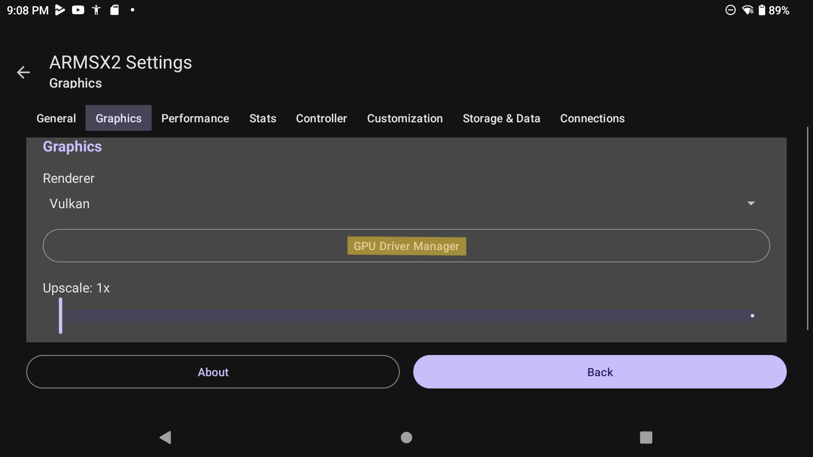
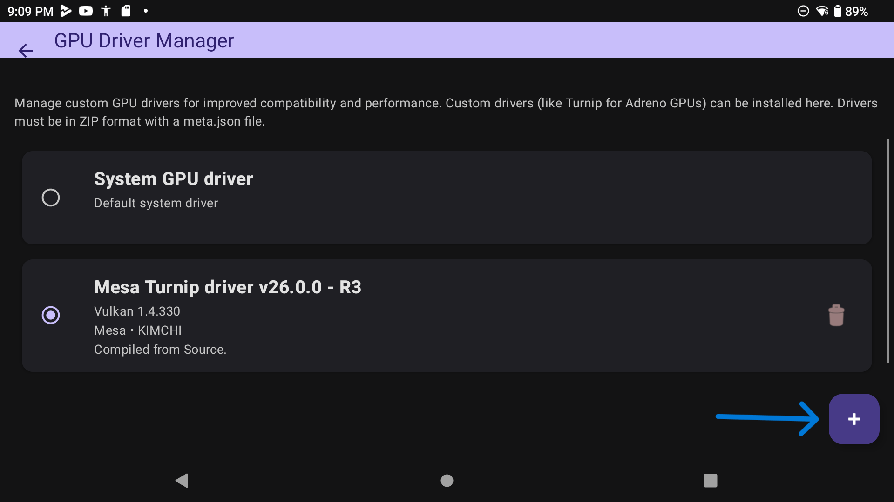
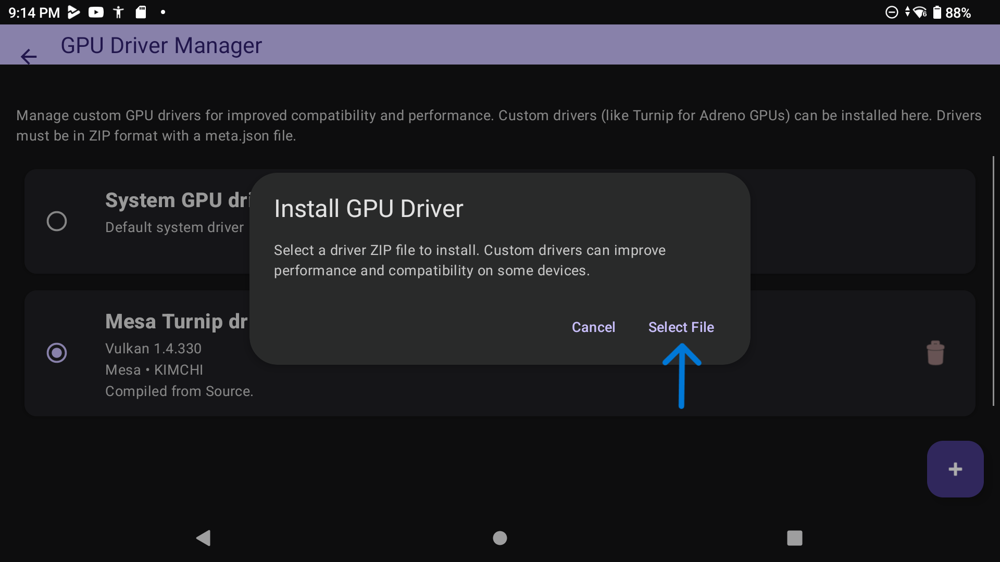
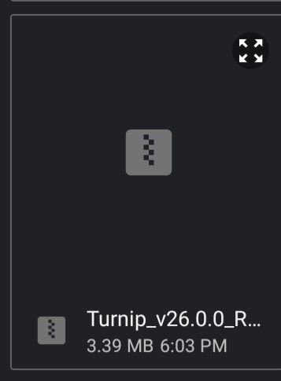

# ARMSX2 Driver Installation

•First you need to go to Settings and tap on the "Graphics" tab:

•Second you need to tap on "GPU Driver Manager":

•Third you need to tap on the "+" button in the bottom-right corner:

•Fourth you need to tap "Select File" in the dialog:

•Fifth in the file picker you need to navigate and select the driver package:

# Setup Complete

For Support visit the <a href="https://discord.gg/TCtbnzAE2s">ARMSX2 Discord</a>.