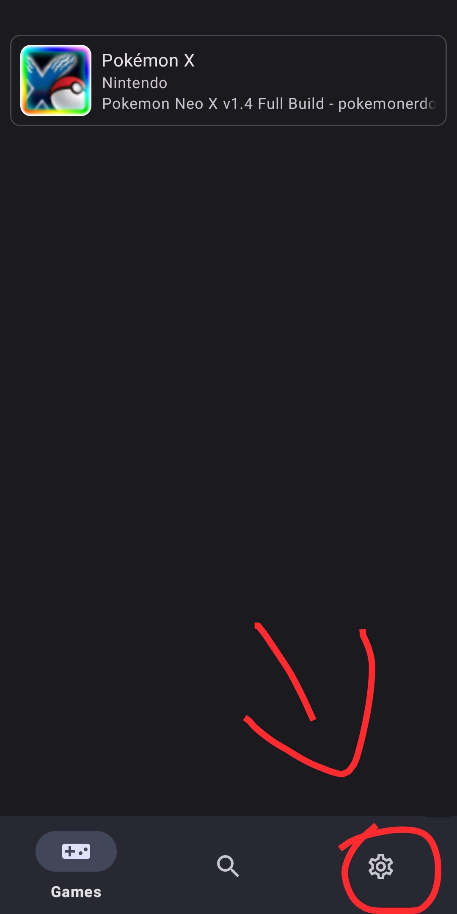
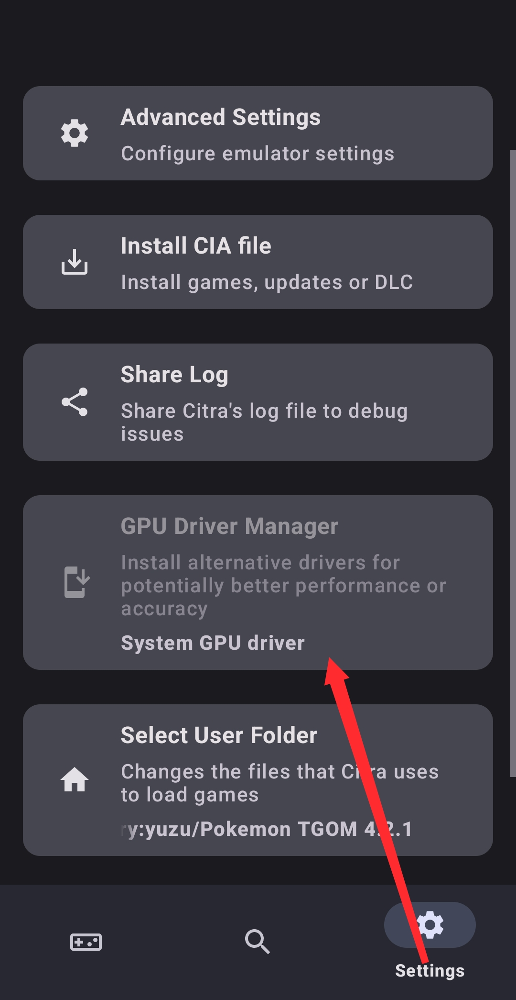
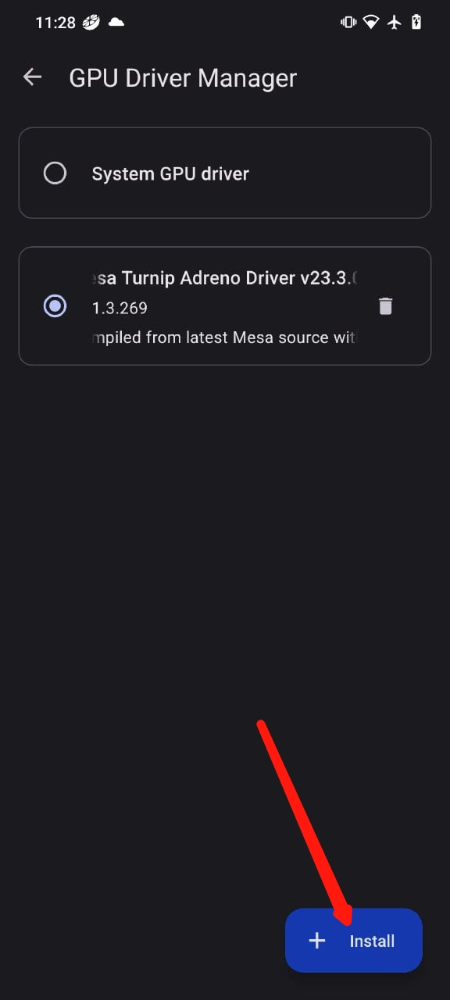

# Citra Usage
•First you need to go to settings👇

•Second you need to click on GPU driver manager 👇

•Third you need to select the driver zip file by clicking on install 👇

# Complete Setup

For Support visit the <a href="https://discord.gg/FAXfZV9">Citra Emulator Official Discord</a>.
