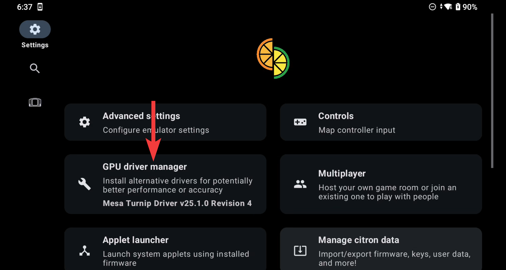
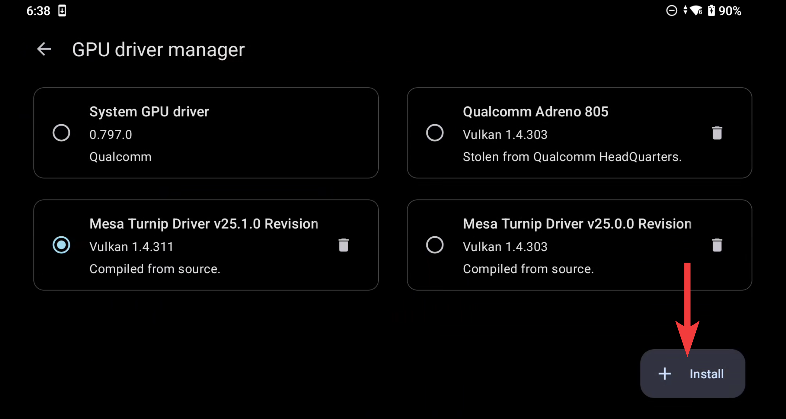
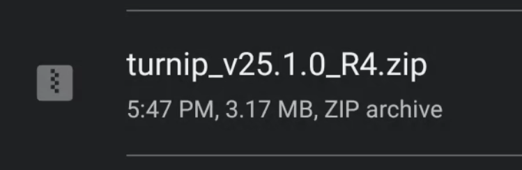

# Citron Driver installation

•Go to Settings and tap "GPU Driver Manager":

•Tap on "Install":

•On the next screen browse to the driver package and select it:

# Setup complete

For Support visit the <a href="https://discord.gg/yB7d72xhKb">Citron Discord</a>.
