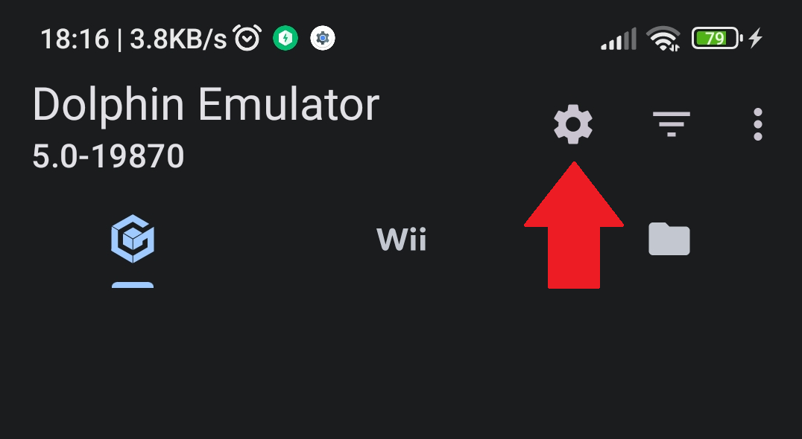

# Dolphin Usage

Tap on the Settings cog on the main screen of the app:

Tap on "Graphics Settings":

Tap on "GPU driver":

Tap on "Install driver":

In the file picker navigate to the driver package and tap on it:

 

For Support visit the <a href="https://discord.gg/sRDuAEy">Dolphin Emulator Official Discord</a>.