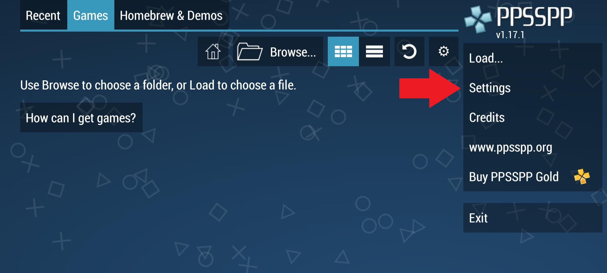
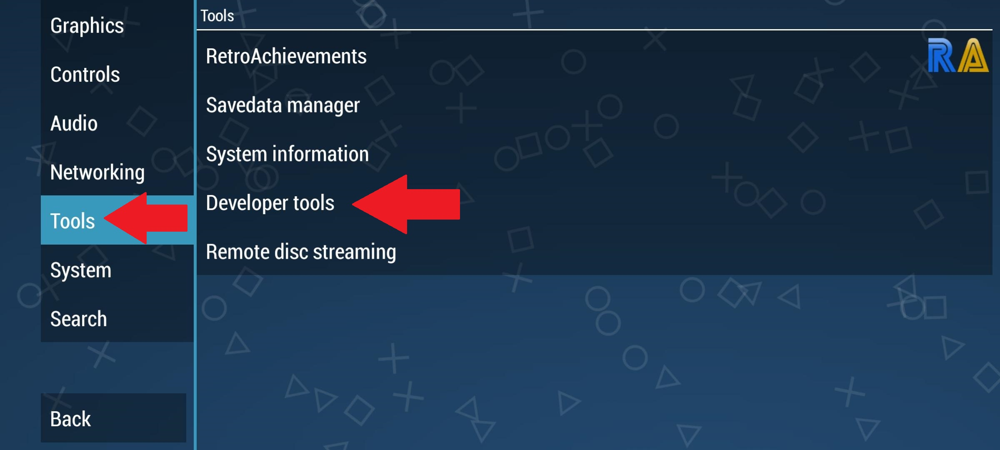
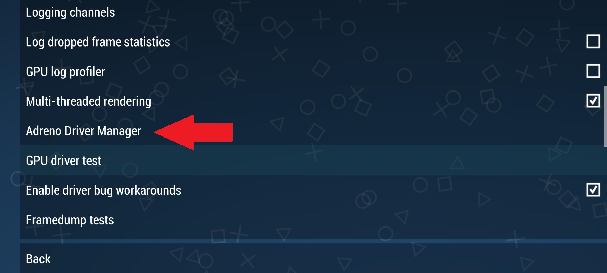
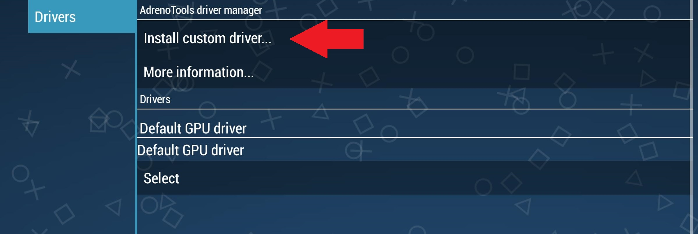

# Citra Usage

•First you need to go to settings:

•Second you need to select "Tools" -> "Developer tools":

•Third you need to select "Adreno Driver Manager":

•Fourth you need to tap on "Install custom driver...":

•Fifth in the file picker you need to navigate and select the driver package:

•Sixth you need to enable custom driver by tapping "Select":

# Complete Setup

For Support visit the <a href="https://forums.ppsspp.org/">PPSSPP forums</a>.
