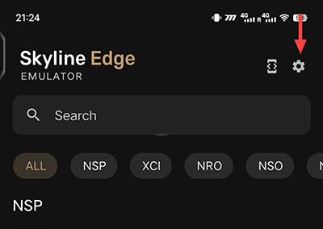
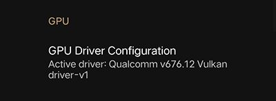

# Skyline Usage

Tap on the Settings cog on the main screen of the app:

Tap on "GPU Driver Configuration" under the GPU category:

Tap on "Install":

In the file picker navigate to the driver package and tap on it:

 
For Support visit the <a href="https://discord.gg/skyline-emu">Skyline Emulator Official Discord</a>.