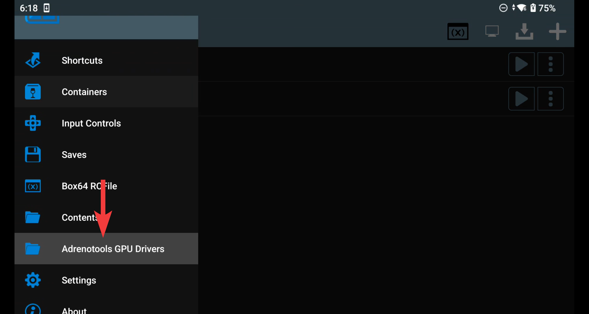
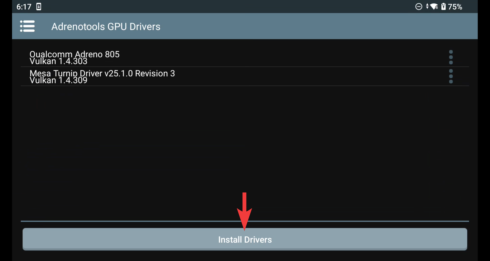
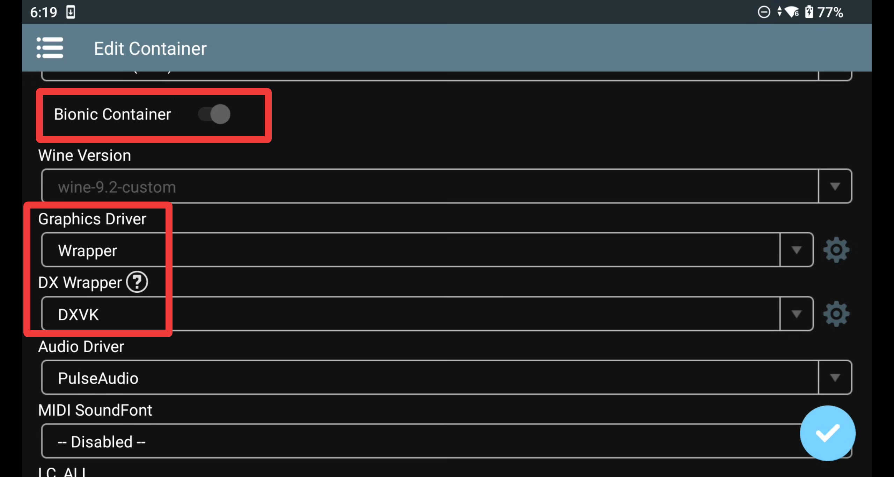
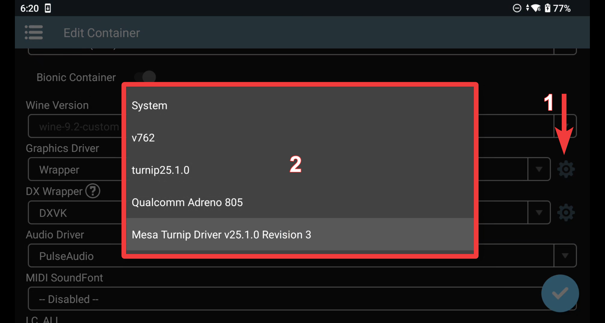

# Winlator Bionic Usage

•First you need to go to settings and tap "Adrenotools GPU Drivers":

•Tap on "Install":

•On the next screen browse to the driver package and select it:

•In the container settings, make sure to select these settings:

•Tap the Graphics Driver cogwheel and select your preffered driver:

# Setup complete

For Support visit the <a href="https://discord.gg/6hrfu9KmcK">EmuGear International Discord</a>.
